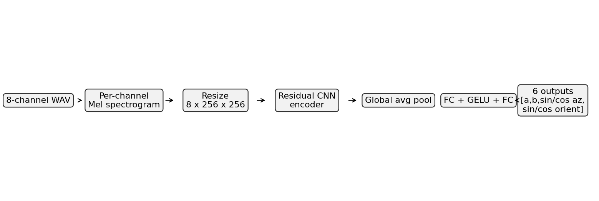
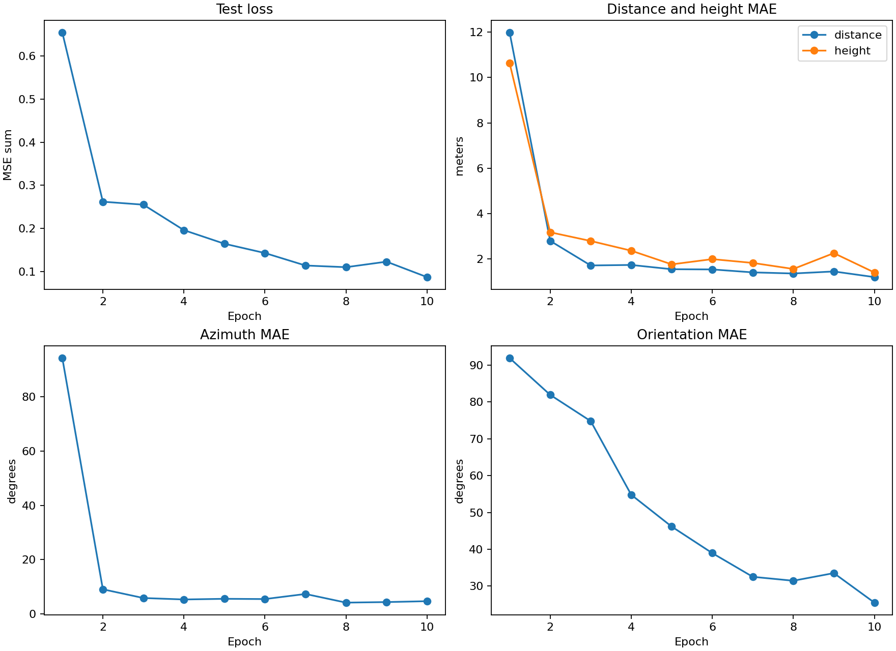
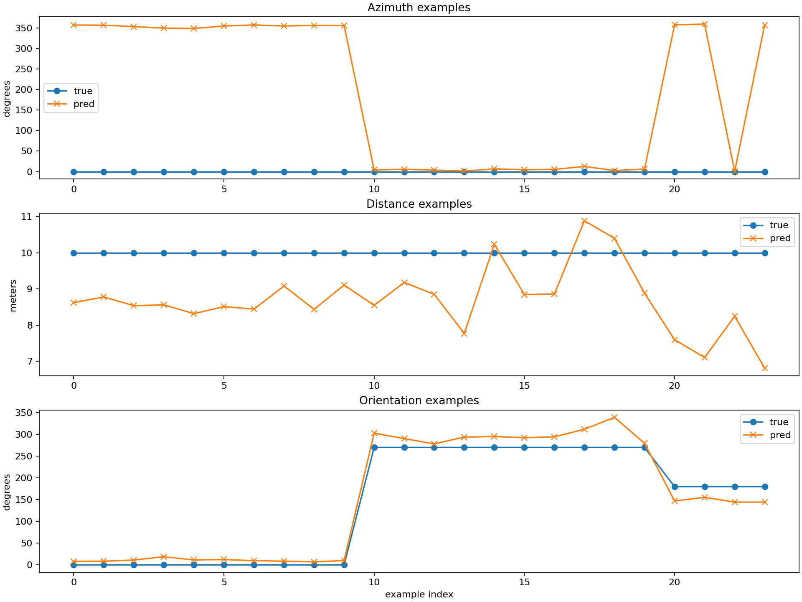

# UaVirBASE Baseline Reproduction

This repository documents and reproduces the baseline pipeline for **UaVirBASE**, a public UAV acoustic sound-source-localization dataset and baseline codebase.

The work reproduces the official pipeline as far as possible:

1. Download the UaVirBASE dataset from Zenodo.
2. Clone and inspect the official GitLab repository.
3. Create a clean Python environment.
4. Install dependencies.
5. Run the official preprocessing pipeline.
6. Train the official model because no pretrained weights are included in the official repository.
7. Evaluate the trained checkpoint.
8. Save logs, figures, metrics, generated models, and a technical reproduction report.

Official dataset:

```text
https://zenodo.org/records/15391924
```

Official repository:

```text
https://gitlab.com/g.jekaterynczuk/uavirbase_ssl
```

Reproduced official commit:

```text
cd3b21ce83d810b269a2038351b2fe2afbf483db
```

## Related Paper

This reproduction is based on the dataset and baseline code released for the UaVirBASE paper:

```text
Jekaterynczuk, G.; Szadkowski, R.; Piotrowski, Z.
UaVirBASE: A Public-Access Unmanned Aerial Vehicle Sound Source Localization Dataset.
Applied Sciences, 2025, 15, 5378.
https://doi.org/10.3390/app15105378
```

Paper DOI:

```text
https://doi.org/10.3390/app15105378
```

Dataset record:

```text
https://zenodo.org/records/15391924
```

Official baseline repository:

```text
https://gitlab.com/g.jekaterynczuk/uavirbase_ssl
```

## Project Purpose

The goal of UaVirBASE is to estimate UAV location-related labels from multi-channel acoustic recordings.

In simple terms, the system listens to a drone using an 8-microphone array and predicts where the drone is relative to the microphone array.

The baseline predicts:

- UAV distance from the microphone array
- UAV height
- UAV azimuth, meaning the horizontal bearing angle relative to the array
- UAV orientation, meaning whether the drone is facing front, left, back, or right relative to the array

This is useful for research in:

- UAV acoustic localization
- sound source localization
- acoustic relative bearing estimation
- GPS-denied or vision-degraded sensing
- Vicon-assisted acoustic dataset generation
- acoustic assistance for drone formation recovery

The model does **not** directly predict a full global 3D position. It predicts relative acoustic labels: distance, height, azimuth, and orientation. A relative 3D position could be derived from distance, height, and azimuth if a coordinate convention is defined.

## What Is Included In The Dataset

The downloaded Zenodo archive is:

```text
Microphone_array.zip
```

Dataset size:

```text
13,783,664,678 bytes
```

Verified MD5:

```text
3C4081511630F8045FDA0347CAC45534
```

After extraction, the dataset contains timestamped recording folders. Each folder contains:

```text
output.wav
label.json
```

The raw dataset used in this reproduction contains:

| Item | Count |
|---|---:|
| Raw recording folders | 132 |
| Raw `output.wav` files | 132 |
| Raw `label.json` files | 132 |
| Raw audio duration | about 1.54 hours |

Audio format:

| Property | Value |
|---|---|
| Format | WAV |
| Channels | 8 |
| Sampling rate | 96,000 Hz |
| Subtype | PCM 32-bit |
| Example interface | Behringer UMC1820 |
| Example microphone type | NTG-2 |
| UAV type | DJI Mavic 3 Cine |

Labels in `label.json` include:

- `distance`
- `height`
- `azimuth`
- `rotation`
- drone type
- movement type
- weather data
- microphone positions
- microphone array center coordinates

Example drone label:

```json
{
  "sound_source": "Drone",
  "type": "DJI Mavic 3 cine",
  "movement": "Static",
  "distance": "20",
  "height": "20",
  "azimuth": "0",
  "rotation": "Front"
}
```

The microphone metadata includes 8 channels around the array center, with microphone azimuths such as:

```text
0, 45, 90, 135, 180, 225, 270, 315 degrees
```

## Repository Structure

The official repository is compact:

```text
uavirbase_ssl/
  README.md
  requirements.txt
  config.py
  main.py
  model.py
  operation.py
  trainer.py
  postprocess.py
```

Purpose of each major file:

| File | Purpose |
|---|---|
| `README.md` | Official minimal instructions. |
| `requirements.txt` | Official dependency list. It is incomplete and needs fixes. |
| `config.py` | Dataset path, model settings, audio feature settings, training settings. |
| `postprocess.py` | Official interactive preprocessing script. |
| `operation.py` | PyTorch Dataset, audio loading, feature extraction, spectrogram creation. |
| `model.py` | Neural network architecture. |
| `trainer.py` | Training loop, loss function, validation metrics, checkpoint saving. |
| `main.py` | Training entry point. |

Additional scripts added for reproduction:

```text
scripts/evaluate_checkpoint.py
scripts/dataset_summary.py
```

These scripts are not part of the official repository. They were added to produce reproducible evaluation tables, prediction examples, training curves, and dataset summaries.

## Method Overview

The baseline follows this pipeline:

```text
8-channel WAV audio
        |
        v
per-channel audio feature extraction
        |
        v
8-channel spectrogram tensor
        |
        v
residual CNN encoder
        |
        v
global average pooling
        |
        v
fully connected regression head
        |
        v
distance, height, azimuth sin/cos, orientation sin/cos
```

The active reproduced configuration uses Mel spectrograms:

| Parameter | Value |
|---|---:|
| Feature type | Mel spectrogram |
| Sample rate | 96,000 Hz |
| `n_fft` | 2048 |
| `hop_length` | 1024 |
| `n_mels` | 128 |
| Input tensor size | `8 x 256 x 256` |

Each audio channel is converted to a spectrogram. The 8 spectrograms are stacked into an 8-channel tensor.

## Baseline Method Details

This section summarizes exactly what model and processing method are used in the reproduced baseline.

### Model Used

The model is defined in:

```text
model.py
```

The main class is:

```python
Classifier(channel_in=8, num_classes=6)
```

Despite the class name `Classifier`, the network is used as a regression model. It predicts continuous values for distance, height, azimuth encoding, and orientation encoding.

The architecture is a residual CNN encoder:

```text
Input: 8-channel spectrogram tensor
  -> Conv2D input layer
  -> ResDown block 1
  -> ResDown block 2
  -> ResDown block 3
  -> ResDown block 4
  -> ResDown block 5
  -> ResDown block 6
  -> ResBlock
  -> Adaptive average pooling
  -> Fully connected layer
  -> GELU activation
  -> Fully connected output layer
  -> 6 regression outputs
```

The residual encoder uses channel scaling blocks:

```python
blocks = (4, 8, 16, 24, 32, 64)
base channel count = 8
```

### Audio Processing Method

The audio processing is defined in:

```text
operation.py
```

The official Dataset class is:

```python
AudioSpectrogramDataset
```

For each sample:

1. Load WAV file with `librosa.load(..., mono=False)`.
2. Require exactly 8 channels.
3. For training, randomly crop audio to 1 second.
4. Normalize waveform:

```python
waveform = (waveform - waveform.mean()) / (waveform.std() + 1e-9)
```

5. Convert each channel into a spectrogram.
6. Convert amplitude to dB using `torchaudio.transforms.AmplitudeToDB`.
7. Stack 8 channel spectrograms.
8. Normalize spectrogram values to `[0, 1]`.
9. Resize spectrogram image to `256 x 256` using Albumentations.
10. Return tensor shape:

```text
[8, 256, 256]
```

### Feature Extraction Method

The repository supports several feature types:

- STFT
- LFCC
- MFCC
- Bark spectrogram
- Mel spectrogram

The reproduced baseline used the active official variation in `config.py`:

```python
{
    "feature_type": "mel",
    "sample_rate": 96000,
    "n_fft": 2048,
    "hop_length": 1024,
    "n_mfcc": 0,
    "n_mels": 128,
    "n_lfcc": 0,
    "n_barks": 0
}
```

So the actual feature extraction method used in this reproduction is:

```text
8-channel Mel spectrogram input
```

### Preprocessing Method

The preprocessing is defined in:

```text
postprocess.py
```

The official script is interactive and has four options:

| Option | Purpose |
|---:|---|
| 1 | Summarize metadata before preprocessing |
| 2 | Summarize metadata after preprocessing |
| 3 | Split raw recordings into 75% train and 25% test long WAV files |
| 4 | Divide long WAV files into short training and test clips |

The reproduction used:

```text
Option 3
Option 4
```

Option 3:

- Reads each raw folder.
- Reads `label.json`.
- Reads `output.wav`.
- Creates label-based folders such as `10_20_45_2`.
- Splits each recording into train and test sections.

Option 4:

- Converts train long WAV files into 1.5 second clips.
- Uses 0.5 second step size for overlapping train clips.
- Converts test long WAV files into 1.0 second clips.
- Randomly samples up to 20 test clips per folder.

### Label Encoding Method

Folder names encode labels:

```text
distance_height_azimuth_orientation
```

Example:

```text
10_20_45_2
```

means:

| Field | Meaning |
|---|---|
| `10` | distance = 10 m |
| `20` | height = 20 m |
| `45` | azimuth = 45 degrees |
| `2` | drone orientation code |

Orientation code mapping:

| Code | Original label | Angle used |
|---:|---|---:|
| 1 | Front | 0 deg |
| 2 | Left | 270 deg |
| 3 | Back | 180 deg |
| 4 | Right | 90 deg |

Distance and height are normalized:

```python
distance_normalized = distance / 50.0
height_normalized = height / 50.0
```

Angles are encoded using sine and cosine:

```python
angle_sin_normalized = (sin(angle) + 1) / 2
angle_cos_normalized = (cos(angle) + 1) / 2
```

### Output Targets

The model outputs 6 values:

```text
[a, b, c_sin, c_cos, d_sin, d_cos]
```

where:

| Output | Meaning |
|---|---|
| `a` | normalized distance |
| `b` | normalized height |
| `c_sin` | normalized sine of azimuth |
| `c_cos` | normalized cosine of azimuth |
| `d_sin` | normalized sine of UAV orientation |
| `d_cos` | normalized cosine of UAV orientation |

### Training Method

Training is defined in:

```text
main.py
trainer.py
```

The training loop:

1. Loads train and test datasets.
2. Builds DataLoaders.
3. Initializes the CNN model.
4. Runs validation at the start of each epoch.
5. Trains on the training split.
6. Saves checkpoints every 5 epochs.

Optimizer:

```python
torch.optim.Adam(lr=0.0002, betas=(0.5, 0.9))
```

Loss:

```text
MSE(distance)
+ MSE(height)
+ MSE(azimuth_sin)
+ MSE(azimuth_cos)
+ MSE(orientation_sin)
+ MSE(orientation_cos)
```

Training configuration used in this reproduction:

| Parameter | Value |
|---|---:|
| Epochs | 10 |
| Batch size | 16 |
| Learning rate | 0.0002 |
| Optimizer | Adam |
| GPU | NVIDIA GeForce RTX 4070 |
| WandB | Disabled |

### Evaluation Method

The official repository only evaluates inside `trainer.py`; it does not provide a standalone inference script.

This reproduction adds:

```text
scripts/evaluate_checkpoint.py
```

The evaluation script:

1. Loads the trained checkpoint.
2. Loads the checkpoint-saved config.
3. Rebuilds the same model.
4. Rebuilds the same test Dataset.
5. Runs prediction on all test clips.
6. Decodes distance, height, azimuth, and orientation.
7. Computes MAE and RMSE.
8. Saves metrics, examples, and figures.

## Model Architecture

The model is a residual convolutional neural network classifier/regressor.

Main components:

1. Initial convolution.
2. Residual downsampling blocks.
3. Final residual block.
4. Global average pooling.
5. Fully connected layer.
6. GELU activation.
7. Final fully connected output layer.

The output has 6 values:

```text
[distance, height, azimuth_sin, azimuth_cos, orientation_sin, orientation_cos]
```

Architecture figure:



## Why Angles Use Sine And Cosine

Angles are circular. For example, 359 degrees and 0 degrees are very close, but a direct numerical loss would treat them as far apart.

To avoid this discontinuity, the model predicts:

```text
sin(angle)
cos(angle)
```

During evaluation, the angle is reconstructed using:

```text
atan2(sin, cos)
```

This is used for both:

- azimuth
- UAV orientation

## Loss Function

The training loss is the sum of six MSE losses:

```text
MSE(distance)
+ MSE(height)
+ MSE(azimuth_sin)
+ MSE(azimuth_cos)
+ MSE(orientation_sin)
+ MSE(orientation_cos)
```

Distance and height are normalized by dividing by 50.

The model uses sigmoid outputs before computing each target loss.

## Installation On A New Computer

These steps assume Windows PowerShell, Python 3.11, Git, and an NVIDIA GPU. CPU training may work but will be much slower.

### 1. Clone this reproduction repository

```powershell
git clone <YOUR_GITHUB_REPO_URL>
cd <YOUR_REPO_FOLDER>
```

If you want to reproduce from the official repository directly:

```powershell
git clone https://gitlab.com/g.jekaterynczuk/uavirbase_ssl.git
cd uavirbase_ssl
```

### 2. Create a clean environment

Recommended workspace:

```powershell
mkdir D:\UaVirBASE_reproduction
cd D:\UaVirBASE_reproduction
python -m venv .venv
.\.venv\Scripts\python.exe -m pip install --upgrade pip
```

### 3. Install PyTorch CUDA wheels

The official `requirements.txt` contains:

```text
torch==2.7.0+cu126
torchaudio==2.7.0+cu126
```

These do not install from normal PyPI. Install them from the PyTorch CUDA 12.6 wheel index:

```powershell
.\.venv\Scripts\python.exe -m pip install torch==2.7.0+cu126 torchaudio==2.7.0+cu126 --index-url https://download.pytorch.org/whl/cu126
```

### 4. Install the remaining dependencies

The official requirements are incomplete. Install the official pins plus missing imported packages:

```powershell
.\.venv\Scripts\python.exe -m pip install filelock==3.13.1 fsspec==2024.6.1 Jinja2==3.1.4 MarkupSafe==2.1.5 mpmath==1.3.0 networkx==3.3 numpy==2.1.2 pillow==11.0.0 sympy==1.13.3 typing_extensions==4.12.2 wandb==0.19.11 albumentations librosa matplotlib pydub tqdm soundfile scipy
```

Alternatively, use the reproduction environment export:

```powershell
.\.venv\Scripts\python.exe -m pip install -r requirements_reproduction.txt
```

Depending on your platform, installing the PyTorch CUDA wheels first is still recommended.

### 5. Verify CUDA

```powershell
.\.venv\Scripts\python.exe -c "import torch; print(torch.__version__); print(torch.cuda.is_available()); print(torch.cuda.get_device_name(0) if torch.cuda.is_available() else 'CPU')"
```

Expected on the reproduced machine:

```text
2.7.0+cu126
True
NVIDIA GeForce RTX 4070
```

## Dataset Download

Dataset page:

```text
https://zenodo.org/records/15391924
```

Direct download command:

```powershell
mkdir D:\UaVirBASE_reproduction\dataset
curl.exe -L --retry 5 --retry-delay 10 --continue-at - --output D:\UaVirBASE_reproduction\dataset\Microphone_array.zip "https://zenodo.org/records/15391924/files/Microphone_array.zip?download=1"
```

Verify checksum:

```powershell
Get-FileHash D:\UaVirBASE_reproduction\dataset\Microphone_array.zip -Algorithm MD5
```

Expected:

```text
3C4081511630F8045FDA0347CAC45534
```

Extract:

```powershell
tar -xf D:\UaVirBASE_reproduction\dataset\Microphone_array.zip -C D:\UaVirBASE_reproduction\dataset
```

Expected extracted path:

```text
D:\UaVirBASE_reproduction\dataset\Microphone_array
```

## Official Preprocessing

The official preprocessing script is interactive:

```text
postprocess.py
```

Before running it, edit these paths:

```python
base_folder_path = r"D:\UaVirBASE_reproduction\dataset\Microphone_array"
processed_path = r"D:\UaVirBASE_reproduction\processed_datasets"
divided_path = r"D:\UaVirBASE_reproduction\divided_datasets"

train_base_dir = r"D:\UaVirBASE_reproduction\processed_datasets\train"
test_base_dir = r"D:\UaVirBASE_reproduction\processed_datasets\test"
```

Run official preprocessing option 3:

```powershell
cmd.exe /c "echo 3| D:\UaVirBASE_reproduction\.venv\Scripts\python.exe postprocess.py"
```

What option 3 does:

- Reads every raw recording folder.
- Opens `label.json`.
- Opens `output.wav`.
- Creates a label-based folder name such as `20_10_45_1`.
- Splits each long recording into 75% train audio and 25% test audio.
- Saves long train/test WAV files under `processed_datasets`.

Run official preprocessing option 4:

```powershell
cmd.exe /c "echo 4| D:\UaVirBASE_reproduction\.venv\Scripts\python.exe postprocess.py"
```

What option 4 does:

- Reads the long train/test WAV files from `processed_datasets`.
- Splits train audio into 1.5 second clips.
- Uses 0.5 second stride for train clips.
- Samples up to 20 one-second test clips per folder.
- Saves the final training-ready dataset under `divided_datasets`.

Expected output:

| Split | Folders | Clips |
|---|---:|---:|
| Train | 132 | 8,040 |
| Test | 132 | 1,340 |

## Training

No pretrained weights were found in the official GitLab repository. Therefore, training was required.

The reproduced training used a practical 10-epoch configuration:

```python
dataset_path = r"D:\UaVirBASE_reproduction\divided_datasets"
epochs = 10
batch_size = 16
print_step = 100
```

Active feature variation:

```python
{
    "feature_type": "mel",
    "sample_rate": 96000,
    "n_fft": 2048,
    "hop_length": 1024,
    "n_mfcc": 0,
    "n_mels": 128,
    "n_lfcc": 0,
    "n_barks": 0
}
```

Run training:

```powershell
D:\UaVirBASE_reproduction\.venv\Scripts\python.exe main.py
```

The reproduction captured logs to:

```text
logs/training_10epochs_stdout.log
logs/training_10epochs_stderr.log
```

Generated checkpoints:

```text
saved_models/mel_96000_2048_1024_0_128_0_0/5_end_unet.pth
saved_models/mel_96000_2048_1024_0_128_0_0/10_end_unet.pth
```

Checkpoint files are large and should not be committed directly to GitHub. Use GitHub Releases, Google Drive, Zenodo, OneDrive, or another artifact store if you need to share them.

## Evaluation

The official repository does not include a standalone inference script. It only evaluates inside `trainer.py`.

For this reproduction, `scripts/evaluate_checkpoint.py` was added.

Run:

```powershell
D:\UaVirBASE_reproduction\.venv\Scripts\python.exe scripts\evaluate_checkpoint.py --checkpoint D:\UaVirBASE_reproduction\uavirbase_ssl\saved_models\mel_96000_2048_1024_0_128_0_0\10_end_unet.pth --out-dir D:\UaVirBASE_reproduction\artifacts --training-log D:\UaVirBASE_reproduction\logs\training_10epochs_stdout.log --batch-size 16 --examples 24
```

This script:

- loads the trained checkpoint
- loads the checkpoint-saved config
- rebuilds the official model
- rebuilds the official test dataset
- evaluates all test clips
- saves final metrics
- saves prediction examples
- saves training curve figures
- saves an architecture diagram

## Reproduction Results

Final checkpoint evaluation on 1,340 test clips:

| Target | MAE | RMSE |
|---|---:|---:|
| Distance | 1.073 m | 1.541 m |
| Height | 1.273 m | 1.729 m |
| Azimuth | 3.457 deg | 5.899 deg |
| Orientation | 25.187 deg | 41.556 deg |

Training curves:



Prediction examples:



Interpretation:

- The model learned azimuth well.
- Distance and height were also learned reasonably well.
- Orientation remained much harder.
- The model is more reliable for acoustic bearing estimation than for drone body orientation estimation.

## What We Learn From This Project

This project shows that multi-channel audio can be used to estimate where a UAV is relative to a microphone array.

Important lessons:

1. Multi-channel audio contains spatial information.
2. A CNN can learn localization cues from spectrograms.
3. Azimuth is the strongest output in this reproduction.
4. Distance and height are possible, but the dataset only has limited distance/height classes.
5. Drone orientation is much harder than direction.
6. The pipeline is not plug-and-play because paths and dependencies need fixes.
7. The official repository does not include pretrained weights.
8. Generalizing from DJI Mavic 3 Cine to Crazyflie requires new data or fine-tuning.

## Technology Explanation

The microphone array estimates UAV direction because sound reaches different microphones differently.

Differences include:

- arrival time
- amplitude
- phase-related patterns
- spectrum
- reverberation
- channel-to-channel energy distribution

The model does not explicitly compute classical TDOA. Instead, it learns the mapping:

```text
8-channel acoustic pattern -> relative UAV labels
```

This is a learned acoustic localization system.

## Applicability To Crazyflie

The current model should not be expected to work directly on Crazyflie.

Reasons:

- Crazyflie is much smaller than DJI Mavic 3 Cine.
- Crazyflie propellers produce a different frequency profile.
- Crazyflie is quieter.
- Indoor reflections matter more.
- Swarm conditions introduce multiple simultaneous sound sources.

To adapt this method to Crazyflie, collect a new dataset with:

- synchronized multi-channel audio
- Crazyflie distance labels
- Crazyflie azimuth labels
- Crazyflie height labels
- Crazyflie yaw/orientation labels
- hover and motion cases
- single-drone and multi-drone cases
- background noise
- Vicon ground truth

## Applicability To ReSpeaker And USB Microphone Arrays

The official model assumes 8 input channels.

For a 4-channel ReSpeaker array:

- change the model input channels from 8 to 4
- retrain the model
- recalibrate for the new array geometry

For an 8-channel USB microphone array:

- input shape may be compatible
- retraining is still recommended
- channel synchronization is critical

Independent USB microphones without hardware synchronization are not ideal for localization because timing consistency matters.

## Applicability To Vicon-Assisted Experiments

This method fits well with Vicon-assisted data collection.

Vicon can provide accurate ground-truth labels:

- relative position
- azimuth
- height
- yaw
- formation state

Audio can provide a backup or complementary sensing channel when Vicon degrades.

Potential research directions:

```text
Acoustic Relative Bearing Estimation for Crazyflie Swarms
```

and:

```text
Acoustic-Assisted Formation Recovery under Vicon Degradation
```

Both are feasible, but they require a Crazyflie-specific dataset and likely sensor fusion rather than audio-only localization.

## Known Issues And Fixes

### Issue 1: Official requirements fail

Problem:

```text
torch==2.7.0+cu126
```

does not install from normal PyPI.

Fix:

```powershell
pip install torch==2.7.0+cu126 torchaudio==2.7.0+cu126 --index-url https://download.pytorch.org/whl/cu126
```

### Issue 2: Missing dependencies

The official repo imports packages not listed in `requirements.txt`:

- `albumentations`
- `librosa`
- `matplotlib`
- `pydub`
- `tqdm`

Install them manually or use `requirements_reproduction.txt`.

### Issue 3: Hard-coded paths

`postprocess.py` uses hard-coded `D:\...` paths.

Fix:

Edit them to match your local dataset location.

### Issue 4: No pretrained weights

The official repository does not include `.pth`, `.pt`, or `.ckpt` files.

Fix:

Train a checkpoint locally.

### Issue 5: Preprocessing randomness

Option 4 uses random sampling for test clips without a fixed seed.

This means exact test clips may differ if preprocessing is rerun.

## Recommended GitHub Repository Contents

Commit these:

```text
README.md
docs/reproduction_report.md
requirements_official.txt
requirements_reproduction.txt
scripts/evaluate_checkpoint.py
scripts/dataset_summary.py
figures/model_architecture.png
figures/training_curves.png
figures/prediction_examples.png
.gitignore
```

Do not commit these directly:

```text
Microphone_array.zip
dataset/
processed_datasets/
divided_datasets/
saved_models/
*.pth
*.pt
*.ckpt
logs/
```

Large datasets and checkpoints should be shared through:

- Zenodo
- GitHub Releases
- Google Drive
- OneDrive
- Hugging Face Datasets / Models

## Citation

If using UaVirBASE, cite the original paper:

```text
Jekateryńczuk, Gabriel, Rafał Szadkowski, and Zbigniew Piotrowski. "UaVirBASE: A public-access unmanned aerial vehicle sound source localization dataset." Applied Sciences 15.10 (2025): 5378.
```

## Final Summary

UaVirBASE demonstrates that an 8-channel microphone array and a CNN-based audio model can estimate UAV relative acoustic labels.

The reproduction confirms that:

- the dataset is available
- the official preprocessing runs
- the official training code runs
- a small 10-epoch training run produces usable results
- azimuth estimation is strong
- distance and height estimation are reasonable
- orientation estimation remains difficult

